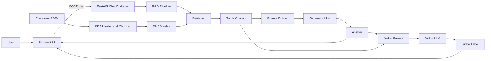

# Ecommerce-RAG-Chatbot

A production-style **Retrieval-Augmented Generation (RAG)** chatbot that answers customer support questions for **Everstorm Outfitters** using their internal policy PDFs.

The system uses:

- **FAISS** vector store for retrieval  
- **Ollama** LLM for answer generation  
- **A separate Ollama LLM as a judge** to evaluate answers (CORRECT / HALLUCINATION / INCOMPLETE)  
- **FastAPI** backend + **Streamlit** UI  
- **Prometheus-compatible metrics** for basic monitoring  


## Project Structure

```text
.
├── app/
│   ├── main.py              # FastAPI app: /chat, /health, /metrics
│   └── schemas.py           # Pydantic request/response models
│
├── rag/
│   ├── config.py            # Settings (paths, model names, hyperparams)
│   ├── data_loader.py       # PDF loading + metadata (source, page)
│   ├── chunker.py           # Text splitting / chunking
│   ├── vectorstore.py       # FAISS index build/load
│   ├── llm.py               # LLM factories (generator + judge)
│   ├── pipeline.py          # RAGPipeline.ask() – main RAG logic
│   ├── evaluator.py         # Inline LLM-as-judge (CORRECT / HALLUCINATION / INCOMPLETE)
│   └── eval_metrics.py      # Classic metrics (BLEU / ROUGE / etc., optional)
│
├── ui/
│   └── app.py               # Streamlit UI (chat + retrieved context + LLM evaluation)
│
├── monitoring/
│   └── metrics.py           # Prometheus metrics: latency, errors, retrieved chunks
│
├── scripts/
│   └── build_index.py       # Offline script to build the FAISS index from PDFs
│
├── data/
│   ├── *.pdf                # Everstorm policy PDFs (input)
│   └── faiss_index/         # Saved FAISS index (output)
│
├── everstorm_eval_dataset.jsonl  # Optional: eval dataset for offline testing
├── requirements.txt
└── README.md
```


