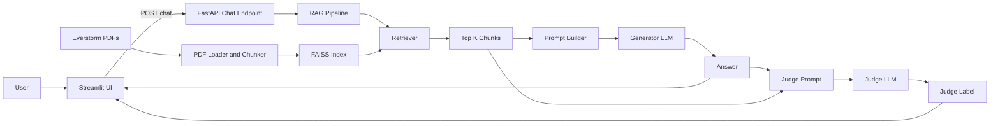

# Ecommerce-RAG-Chatbot
A production-style **Retrieval-Augmented Generation (RAG)** chatbot that answers customer support questions for **Everstorm Outfitters** using their internal policy PDFs.

The system uses:

- **FAISS** vector store for retrieval  
- **Ollama** LLM for answer generation  
- **A separate Ollama LLM as a judge** to evaluate answers (CORRECT / HALLUCINATION / INCOMPLETE)  
- **FastAPI** backend + **Streamlit** UI  
- **Prometheus-compatible metrics** for basic monitoring  


## Project Structure

```text
.
├── app/
│   ├── main.py              # FastAPI app: /chat, /health, /metrics
│   └── schemas.py           # Pydantic request/response models
│
├── rag/
│   ├── config.py            # Settings (paths, model names, hyperparams)
│   ├── data_loader.py       # PDF loading + metadata (source, page)
│   ├── chunker.py           # Text splitting / chunking
│   ├── vectorstore.py       # FAISS index build/load
│   ├── llm.py               # LLM factories (generator + judge)
│   ├── pipeline.py          # RAGPipeline.ask() – main RAG logic
│   ├── evaluator.py         # Inline LLM-as-judge (CORRECT / HALLUCINATION / INCOMPLETE)
│   └── eval_metrics.py      # Classic metrics (BLEU / ROUGE / etc., optional)
│
├── ui/
│   └── app.py               # Streamlit UI (chat + retrieved context + LLM evaluation)
│
├── monitoring/
│   └── metrics.py           # Prometheus metrics: latency, errors, retrieved chunks
│
├── scripts/
│   └── build_index.py       # Offline script to build the FAISS index from PDFs
│
├── data/
│   ├── *.pdf                # Everstorm policy PDFs (input)
│   └── faiss_index/         # Saved FAISS index (output)
│
├── everstorm_eval_dataset.jsonl  # Optional: eval dataset for offline testing
├── requirements.txt
└── README.md
```



## Offline Evaluation Benchmark

To measure the reliability and grounding of the RAG system, we evaluated it using a 55-question
Everstorm policy dataset.

Each question includes:

- the user query  
- ground-truth answer  
- retrieved context  
- model-generated answer  
- evaluation metrics (BLEU, METEOR, ROUGE-L)  
- LLM-as-judge classification  

### Evaluation Methodology

The evaluation pipeline runs:

1. **RAG retrieval** using FAISS
2. **LLM generation** using the main model (llama3.1)
3. **Self-critique LLM-as-Judge**  
   - up to 3 cycles of reflection  
   - labels answer as CORRECT / INCOMPLETE / HALLUCINATION / MAX_CYCLES
4. **Lexical similarity metrics**  
   - BLEU  
   - METEOR  
   - ROUGE-L  
5. **Aggregate metrics** across the dataset

---

### Results Summary

| Metric | Value |
|--------|--------|
| Total Questions | **55** |
| Correct (%) | **74.5%** |
| Hallucination (%) | **9.0%** |
| Incomplete (%) | **12.7%** |
| Max Cycles (%) | **3.6%** |
| Avg BLEU | **0.18** |
| Avg METEOR | **0.11** |
| Avg ROUGE-L | **0.42** |

LLM-as-Judge is the primary metric for correctness because RAG answers are often concise and paraphrased; lexical metrics may show low scores despite semantically correct answers.

---

2. Evaluation Pipeline Flow

The offline evaluation script (scripts/run_offline_eval.py) runs the following steps for each question:

- Retrieve documents with RAG
- Generate answer with the main LLM
- Run LLM-as-Judge
- Up to 3 critique cycles
- Produces a label: CORRECT, HALLUCINATION, INCOMPLETE, or MAX_CYCLES
- Compute BLEU / ROUGE-L / METEOR
- Log per-question results
- Aggregate final metrics:
-- % CORRECT
-- % HALLUCINATION
-- % INCOMPLETE
- Average BLEU / ROUGE / METEOR
- Failure / timeout rat


## Prerequisites
- **Python 3.10+**  
  (Project tested on Python **3.11** and **3.13**)

- **Ollama** installed and running locally  
  https://ollama.com

- **Required models (pull via Ollama):**
  ```bash
  ollama pull llama3.1          # generator LLM
  ollama pull qwen2.5:0.5b      # judge LLM (fast & small)
## Setup & Run

### **1. Clone the repo & create a virtual environment**

```bash
git clone <your-repo-url> Ecommerce-RAG-Chatbot
cd Ecommerce-RAG-Chatbot

python -m venv .venv
